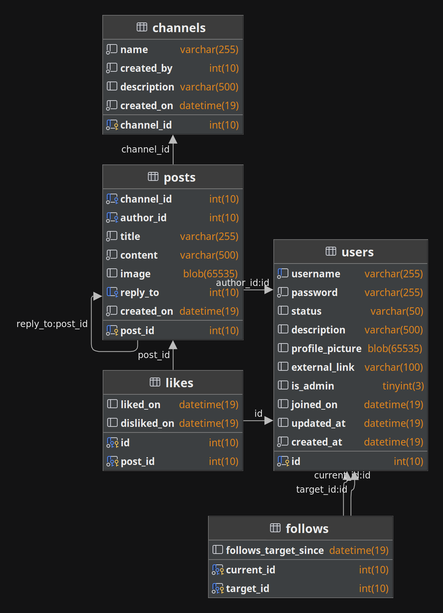

# Our Place

Welcome to Our Place, a simple social media platform made with 
[Laravel](https://laravel.com).

> Note: I intended to add the ability to add likes/dislikes to posts, reply to other
> posts, and follow other users, but I ran out of time. I have included the tables
> for these features in the CREATE script, but they are not used in the application.

## Table of Contents

* [Deployment](#deployment)
* [Executive Summary](#executive-summary)
* [Business Rules](#business-rules)
* [Entity Relationship Diagram](#entity-relationship-diagram)
* [Create Script](#create-script)

## Deployment

(Recommended)  
You may view this project running on my domain through Heroku at
[https://our-place.grelk.tech](https://our-place.grelk.tech).

If you would like to run this project locally, you may clone this repository, install
php and myswl, and run the following commands in the root directory of the project:

Install dependencies:

```bash
composer install
```

Set up the database:

```bash
mysql -u root -p < create.sql
```

Start the server:

```bash
php artisan serve
```

The site should then be live at [http://127.0.0.1:8000](http://127.0.0.1:8000).

## Executive Summary

Our Place is a simple social media site in which users communicate through posts. When
the user navigates to the site for the first time, he or she will be prompted to
register an account. If the user already has an account, he or she may log in. Once
signed in, the user can view all of the channels with some information about each,
such as the channel description, creation date, creator, and number of posts. On this
screen, the user may also log out. If the user clicks on the name of a channel, the
user is redirected to that channel's page. On there, there is the channel's 
description and a list of all of the posts in order of creation. Each post depicts 
the post title, author, content, and creation date. If the user made the post, there
is also buttons to edit or remove the post. Finally, there is an input form to add
a new post with a given title and body. If the user is an administrator, the admin
will be able to add new channels and delete any post.

## Business Rules

The constraints and requirements of the database.

### Users

The people who use the site

* Can make many posts
* Can follow many other users
* Track:
    * User ID: a unique, hidden value to identify each user
    * Username: a unique, publicly visible name for each user
    * Password: an encrypted, hidden value for authentication
    * Description: an optional, publicly displayed description of the user
    * Status: a short description of what the user is doing
    * Profile picture: a circular picture displayed on posts
    * External link: an optional link to any page the user wants
    * Is admin: if the user is an admin, which gives elevated permissions
    * Joined on: a timestamp that shows when the user made their account

### Posts

Content created by the users in a channel

* Posts are made by one and only one user
* Posts can be reacted to by many users
* Track:
    * Post ID: unique identifier for each post
    * Channel ID: ID of the channel the post is in
    * Author ID: ID of the user who made the post
    * Title: user-inputted subject of the post
    * Content: the text of the post
    * Attachment: an optional image to be displayed under the post
    * Reply to: if the post is responding to another, this holds the post ID
    * Created on: the datetime the post was made

### Channels

A container for posts of a specified topic

* Made by one user
* Can have no or many posts
* Track:
    * Channel ID: unique identifier of the channel
    * Created by: the user who created the channel
    * Name: the name of the channel
    * Description: text that describes what messages should be in a channel
    * Created on: the time the channel was created

### Likes

The relationship between users and posts

* A post can be liked by many users
* A user may like many posts
* A user may not both like and dislike a post
* A user may react to their own post
* Track:
    * User ID: the ID of the user in question
    * Post ID: the ID of the post
    * Liked on: the time the post was liked, if this is filled, the user has liked the post
    * Disliked on: the time a post was disliked by a user

### Follows

The relationship between two users

* A user may follow many other users
* One user may have many followers
* Track:
    * User 1 ID: the ID of the first user
    * User ID 2: the ID of the second user
    * User 1 followed user 2 on: the time user 1 followed user 2, null if user 1 is not following user 2

## Entity Relationship Diagram



## Create Script

You may find the CREATE script [here](create.sql).
